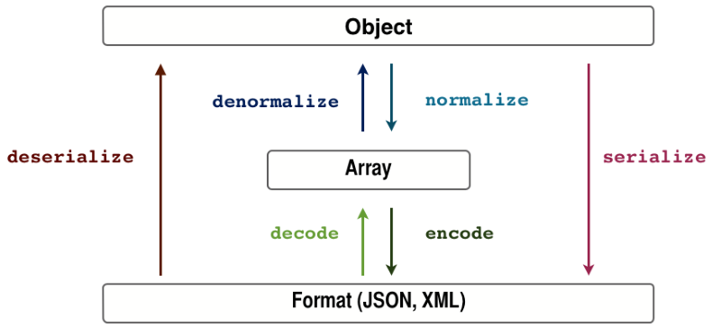

# Java序列化框架入门学习

## 练习项目
- [JDK序列化](projects/jdk_serialize_test)
- [Hessian序列化](projects/hessian_test)
- [MsgPack序列化](projects/msgpack_test)
- [Kryo序列化](projects/kryo_test)
- [Thrift序列化](projects/thrift_test)
- [Protobuf序列化](projects/protobuf_test)

## 对比分析
| 框架 | 优点 | 缺点 |
|:---:|:---:|:---:|
| Java | JDK自带实现，包含对象的所有信息 | 速度较慢，占用空间较大，只支持Java语言 |
| Hessian | 支持的语言比较多，兼容性较好 | 较慢 |
| MsgPack | 使用简单，速度快，体积小 | 兼容性较差，耗资源 |
| Kryo | 速度快，序列化后体积小 | 跨语言支持较差，文档较少 |
| Thrift | 高效 | 需要静态编译 是Thrift内部序列化机制，很难和其他传输层协议共同使用 |
| Protobuf | 速度快 | 需要静态编译 |
